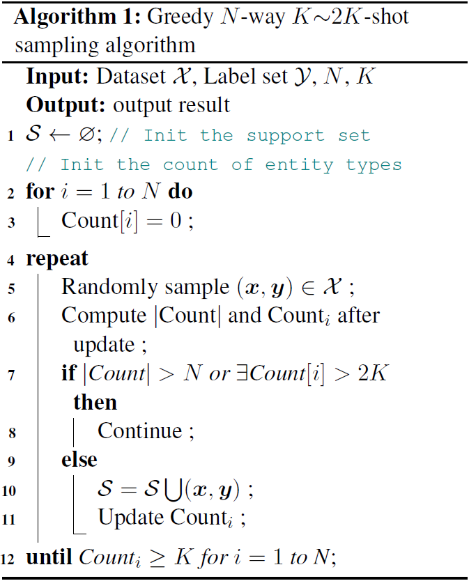
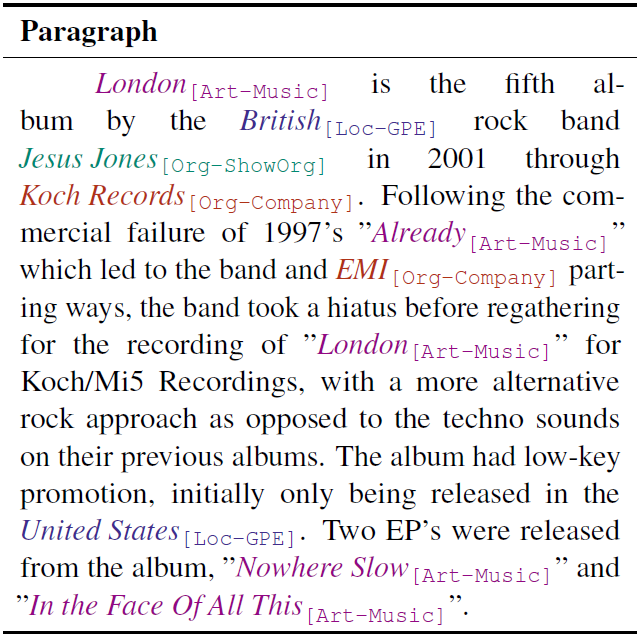
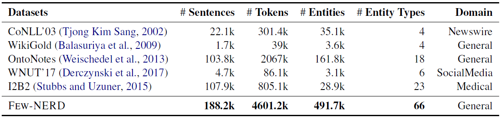
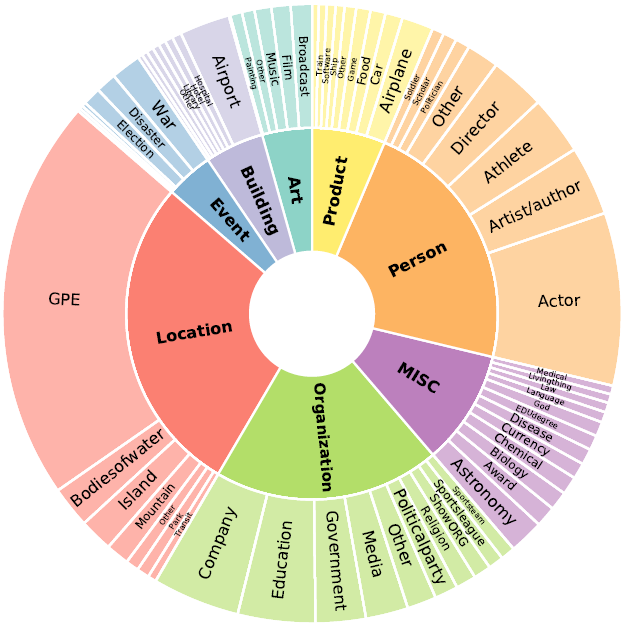
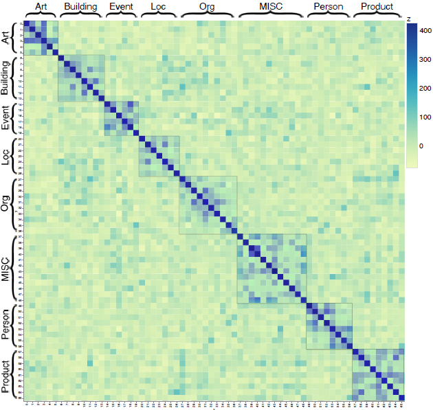
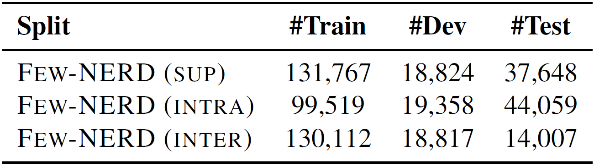
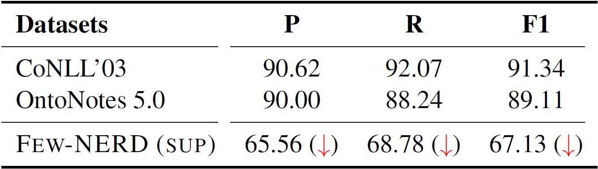
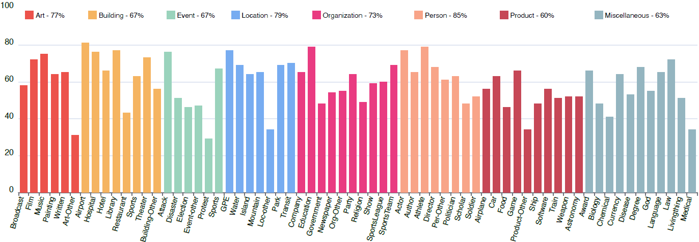
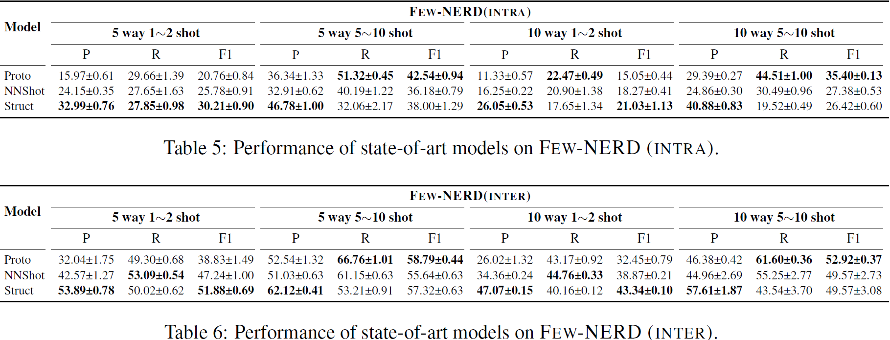

# Abstract

- 当前的研究**缺少贴近现实的、有挑战性的少样本NER的benchmark**
- 已有的方法是将有监督NER数据集进行重新组织，形成少样本的设置进行研究。这些策略的目标是识别出只有少量样本的粗粒度类型，但**实际中大多数未见过的实体类型是细粒度的**

# 1. Introduction

## 背景

现有的两类NER方法

- 基于DNN
- 基于带有额外分类器的BERT。这样的研究说明**用大规模标注语料训练的深度模型可以取得杰出的效果**

由于各种领域知识的专业性，实体很难大规模地手工标注，因此**研究能够学习只有少量样本的未见过的实体类型的NER系统很重要**

目前还没有专门设计用于少样本NER的数据集，都是重新组织一些有监督数据集形成少样本的设置，这些方法面临两个挑战

1. 大多数用于少样本学习的数据集只有4~18个粗粒度的实体类型，让构造一个具有充分的多样性的N-way元任务和学习关联特征变得困难。实际应用中大多数未见过实体类型是细粒度的
2. 由于缺乏benchmark，不同工作的设置是不一致的

## Few-NERD概况

既是专门为少样本NER构造的第一个数据集，也是最大的人工标注NER数据集之一

- 来自维基百科文章的**188.2K**条句子
- 由受过训练的标注手工标注的**491.7K**个实体
- **8个粗粒度实体类型**和**66个细粒度实体类型**

## benchmark设置

设计了三种基于FEW-NERD的任务

- 标准有监督任务设置(FEW-NERD(SUP))
- 少样本任务
  - FEW-NERD-INTRA
  - FEW-NERD-INTER

FEW-NERD (SUP), FEW-NERD (INTRA), 和FEW-NERD (INTER)分别对NER方法的**实例级泛化**、**类型级泛化**和**知识迁移**进行了评估

# 3. 问题定义Problem Formulation

## NER

给输入序列 $\boldsymbol{x} = \{x_1, x_2,...,x_t\}$中的每一个token $x_i$分配一个来自预定义集合$\mathcal{Y}$中的标签$y_i$

## 少样本NER

- 训练阶段：迭代地构造片段来实现**N路K样本学习**
  - 每个训练片段中有**N个类别（N路）**，每个类别有**K个样本**，构成K×N个样本的**支持训练集**$\mathcal{S}_{train}$
  - 每个类别有K'个样本，构成K‘×N个样本的**查询训练集$\mathcal{Q}_{train}$**
  - **S和Q没有交集**
  - 在训练时，少样本学习系统用$\mathcal{S}_{train}$中的信息预测$\mathcal{Q}_{train}$中样本的标签。
  - 在训练过程中$\mathcal{S}_{train}$和$\mathcal{Q}_{train}$是有监督的
- 测试阶段
  - 也有两个集合$\mathcal{S}_{test}$和$\mathcal{Q}_{test}$
  - **S和Q没有交集**
  - **在测试阶段所有的类别是训练过程中未见过的**
  - 少样本学习系统需要用仅有少量的标注样本的支持集合$\mathcal{S}_{test}$来预测没有标注的查询集合$\mathcal{Q}_{test}$

**在序列标注问题比如NER中， 一个句子可能包含多个来自不同类别的实体；而且按句子级别进行采样是必需的，因为对于序列任务尤其是NER上下文信息是至关重要的。所以采样相比传统的分类任务比如RE要更难**。

FEW-NERD的采样算法如下：通过贪心采样算法构造N路K~2K样本集合

# 4. FEW-NERD收集

## 4.1 实体类型schema

FEW-NERD受到FIGER数据集的schema的启发，但**关注命名实体**，**忽略了值/数字/时间/日期这些类型**

两级的层次结构

- 粗粒度：8种
  - Person 任务
  - Location 地点
  - Organization 组织
  - Art 艺术品
  - Building 建筑
  - Product 商品
  - Event 事件
  - Miscellaneous 其他
- 细粒度：66种

最终以<粗粒度类型-细粒度类型>的形式标注

## 4.2 paragraph选择

FEFW-NERD使用了完整的英文维基百科dump，包括了大量的实体和充足的语境信息

**FEW-NERD在paragraph级别进行标注**，所以高效地选择带有充分信息的段落是至关重要的。

另外，**数据类别的分布也期望是平衡的，因为数据要用在少样本场景**。这也是FEW-NERD与之前NER数据集的关键区别——**之前的数据集的实体分布都是不均匀（uneven）的**。为了实现数据平衡做了以下工作

- 通过自动地收集在FIGER中的标注了的实体mentions为每个细粒度类型构造一个词典，然后手动地去除词典中的噪声
- 开发一个搜索引擎来检索包含远程字典实体mentions的paragraph。为每个实体，选择10个段落构造一个候选集；然后给每个细粒度类型随机选择1000段进行人工标注

最终选出**66000个paragraph**，包括**66种细粒度实体类型**，每个paragraph平均包含61.3个标记

## 人工标注

**由于命名实体期望是上下文独立的，所以命名实体的标注很复杂，尤其是实体类型数量很大**

# 5. 数据分析

## 大小和分布

## 类型之间的知识关联

**知识迁移对少样本学习至关重要**

- 共享相同粗粒度类型的实体类型通常具有更大的相似性，从而更容易实现知识转移
- 尽管一些细粒度类型的实体存在较大的相似度，但大多数处于不同粗粒度类型的类型由于不同的语境特征，共享的关联非常少

# 6. Benchmark设置

表中样本数指句子数量

**在少样本benchmark中移除了没有实体的句子**

基于FEW-NERD构造了以下三个任务

## 标准有监督NER：FEW-NERD (SUP)

随机挑选的方法将数据切分成以下部分：

- 70%的数据作为训练数据（训练集）
- 10%的数据作为验证数据（开发集）
- 20%的数据作为测试数据（测试集）

训练、开发和测试集都覆盖所有66个类型

## 少样本NER

**少样本学习的核心是学习只有少量样本的新类别**

1. **将所有实体集合（记为$\mathcal{E}$）分为三个互斥不相交的子集**，分别记为$\mathcal{E}_{train}$ ，$\mathcal{E}_{dev}$和 $\mathcal{E}_{test}$
   $$
   \mathcal{E}_{train} \bigcup \mathcal{E}_{dev} \bigcup \mathcal{E}_{test} = \mathcal{E}
   \\
   \mathcal{E}_{train} \bigcap \mathcal{E}_{dev} \bigcap \mathcal{E}_{test} = \phi
   $$
   **所有的类型为细粒度**。

2. 在训练，开发和测试集中的实例分别仅由$\mathcal{E}_{train}$ ，$\mathcal{E}_{dev}$和 $\mathcal{E}_{test}$中的实体组成。但NER是一个序列标注问题，有可能一个句子会包含多个不同的实体。**为了避免在训练阶段观测到新的实体类型，将$\mathcal{E}_{train}$中属于$\mathcal{E}_{test}$的实体的标签换成O**

3. 和上一步相似，**将$\mathcal{E}_{test}$中属于$\mathcal{E}_{train}$ ，$\mathcal{E}_{dev}$的实体的标签换为O**

### FEW-NERD(INTRA)

1. 按照**粗粒度类型**构造$\mathcal{E}_{train}$ ，$\mathcal{E}_{dev}$和 $\mathcal{E}_{test}$，也就是**不同的集合中的实体属于不同的粗粒度类型**
2. 为了尽量少地将实体替换为O，将所有属于People, MISC, Art, Product的细粒度类型分配给$\mathcal{E}_{train}$，所有属于Event, Building的细粒度类型分配给$\mathcal{E}_{dev}$，所有属于ORG, LOC的类型分配给$\mathcal{E}_{test}$。

这种设置下，三个集合共享很少的知识，形成一个比较难的benchmark

### FEW-NERD(INTER)

这个任务下，$\mathcal{E}_{train}$ ，$\mathcal{E}_{dev}$中的所有细粒度类型是互斥不相交的，但在粗粒度类型上有共享

粗略地将所有8个粗粒度类型的60%的细粒度类型分配给$\mathcal{E}_{train}$，给$\mathcal{E}_{dev}$和 $\mathcal{E}_{test}$分别分配20%。这种设置是为了**探究粗粒度信息会不会影响新实体的预测**

# 7. 实验

## 模型

采用**BERT**作为**主干编码器**

记参数为$\theta$，编码器为$f_\theta$。给定序列$\boldsymbol x=\{x_1,...,x_n\}$，对于每个token$x_i$，编码器生成对应的上下文化表示：
$$
\boldsymbol h = [\boldsymbol h_1, ...,\boldsymbol h_n]=f_\theta([x_1,...,x_n])
$$

- BERT-Tagger：一个广泛承认的基线，在有监督NER上可以产生明显的结果
- Proto-BERT：使用原型级别上的分数解决NER
- NNShot&StructShot：使用token级别上的分数解决NER

通过考察测试片段的查询集$\mathcal{Q}_{test}$来评估模型，计算在所有测试片段上的精度P，召回率R，和微F1分数

**使用IO schema对token进行标注，用I-type表示一个命名实体的token，用O表示其他token**

## 结果

- BERT-Tagger在几个数据集上的标准监督学习性能

  

  

  

- 在FEW- NERD (SUP)上不同实体类型的F1得分，报告图例上是每种粗粒度实体类型的平均性能

  

- 各种SOTA模型在少样本设置的FEW-NERD上的性能

  

