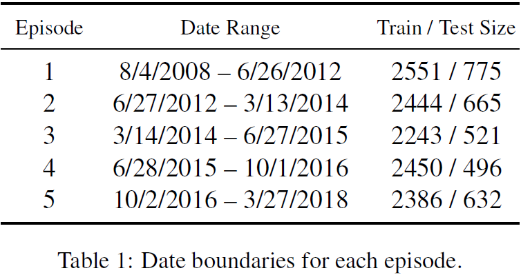
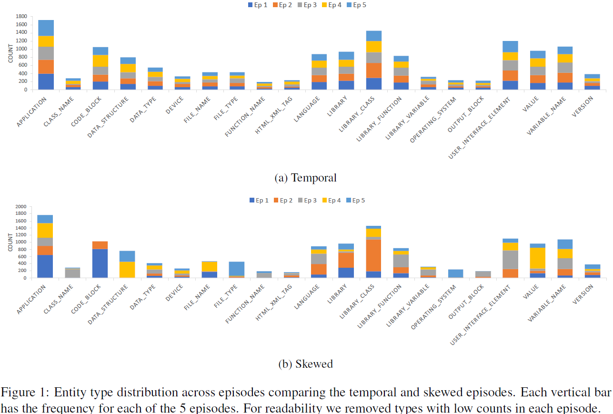
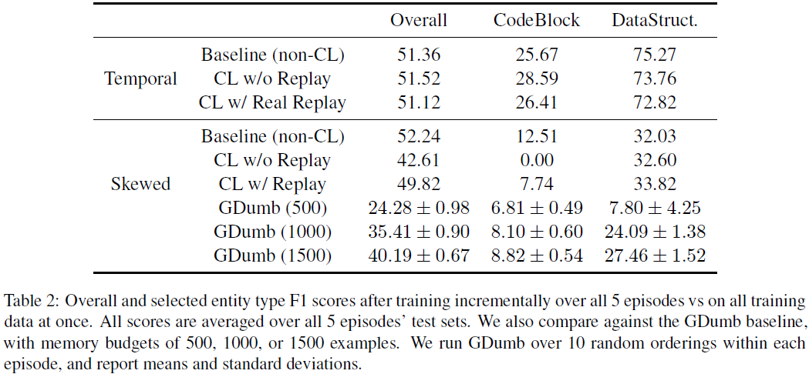
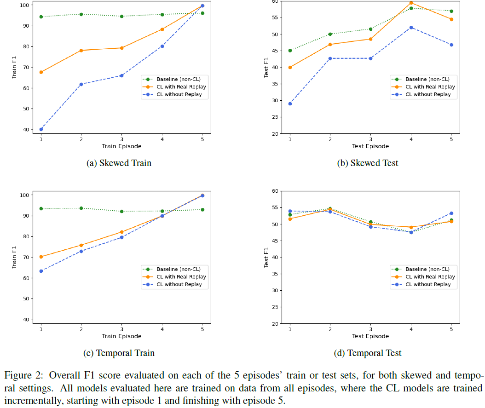

# Abstract

本文讨论了**公开数据集的一些不贴近现实的特性**，研究了**贴近现实的单任务持续学习的挑战**以及**数据重演作为一种减缓精度损失的方法的有效性**

# 1. Introduction

数据隐私在ML领域是一个很热门的话题，在工业和学术界取得了广泛的关注。其中一个关注的主题是数据保持能力，一般可以通过增量地训练模型实现。一个理想的训练方式应该包含在新获得的数据上持续地更新模型然后删除这些数据。**学术研究中的CL策略的基准目前仍然高度不标准**

现实世界和学术数据集的关键差异在于前者的动态的特性。学术数据集通常是静态地，包含的通常是基于固定的标注准则一次性全部标好的数据。构造现实应用时这样的数据收集和标注工作流通常不贴近现实。而且一个初始数据集创建好后会基于使用模式的改变和商业需求随时间演化。比如定期地添加新的标签，数据分布受到季节性或其他因素发生重大变化，标注准则发生更新等。尽管这样的数据集存在于工业界，它们通常是机密的或专有的，不能与研究社区共享。

这样就导致**学术的CL研究的交点主要在多任务学习场景**，即**相同的模型需要增量地学习一些孤立的任务且不忘记如何解决之前的问题。**本文的工作着手于**单任务的NER场景**。**只有一个任务，但会受到数据分布的移动、新标签的引入或其他因素随时间不断演化**。单任务通常被认为比多任务更难，同时也是一个常见的现实场景。

由于没有为研究单任务CL设计的公开的NLP基准，本文选择`StackOverflowNER`数据集。该数据集非常适合CL研究

- 包含跨度大概有10年（2008~2018）的问答主题
- 标注了接近30个实体类型
- 规模较大
- 手工标注过程类似于工业用例，在工业用例中，标注过程可能会受到噪声和人为错误的影响

为了模拟CL，**将数据分成基于时间的片段**然后**增量地在5个片段上训练一个NER模型**，结果没有性能的倒退，只有有限程度的遗忘。为了提出一个**更贴近现实的挑战，受一个可信工业数据集启发提出了一个可配置的基于分布的数据采样**。结果表明，本文的样本片段**可以用于研究NER背景下的不同单任务CL策略的有效性**。得到的数据集是这项工作的主要贡献。

# 2. Continual Learning

## 策略

以CL范式训练深度学习模型的主要焦点是防止灾难性遗忘，即在新数据上训练的NN会表现出对旧数据的性能退化。为了减缓灾难遗忘有很多不同的策略被提出，比如特定的CL架构、正则化技术和数据重演rehearsal/重放replay——（真实或生成的）旧数据在新数据上训练时定期地提供给模型。后者被认为是一个强大的CL基线，因此本文在研究中采用了这个方法。本文也和基于重放的GDumb基线的一个变体做了对比。**GDumb将样本收集进一个有限大小为k的记忆缓冲区中，并通过贪心地采样under-represented的标签类型和弹出over-sampled标签类型来平衡记忆中的标签分布**。该模型在所有任务被观测过后再缓冲区上训练。

## 本文CL模型

本文模型的设计受到LAMOL的启发，并适配到了NER任务。

- 采用一个预训练的GPT-2语言模型作为基底
- 然后接一个每个方向的维度为768的双层BiLSTM
- 然后是一个tanh非线性和线性转换层，根据标签的数量维度为1536
- 最后是一个CRF层用于预测标签

除了`GPT-2`（在OpenAI WebText上预训练好的）所有参数随机初始化，然后在训练过程中训练或微调所有参数。**本文假设所有实体类型提前已知，所以如果在后一个episode有新标签引入就不用再扩展标签集合的size**。在本文的实验中，我们的基线是对所有训练数据进行微调的模型。本文比较了基线与`GDumb`和两种CL策略：有和没有数据重放的训练

## 数据重放

对于每个episode（除了第一个)，**按当前episode的训练集的20%从之前episode中采样重放样本，每个之前的episode采样的数量相同**。为了将`GDumb`应用到`NER`，本文**将包含under-represented的实体类型的样本添加到记忆缓冲区中，并剔除对最不well-presented的实体类型由最大值的样本**

# 3. 实验设置

## 3.1 基于时间的episode设置

本文的第一个动机就是**调研时间上的持续学习**

本文从`StackOverlfowNER`数据集中构造持续学习数据集。该数据集是一个`StackOverflow`上的问答数据集，用28个实体类型标注。本文将其训练和开发集合并作为训练episode的采样池，使用其测试集作为测试episode的采样池

先将`StackOverflowNER`数据分割成5个基于时间的episode。`StackOverflowNER`数据集没有时间戳，所以将标注样本与`StackOverflow`数据转储中的帖子对齐，然后切分出episodes得到大小基本相等的训练和测试集，如上图所示

## 3.2 结果

图1a展示了每个实体类型在5个时间片段上的分布。尽管一些类型相比其他更常见，但频率分布在所有片段上是一致的。带有特定实体类型标记的示例的百分比在剧集中变化不大，随着时间的推移，也不会删除或添加新的实体类型。这样的数据特征对于经过10年发展的实际应用程序来说是不现实的。

本文在5个片段上**使用/不使用数据重放增量地训练模型**，与**在所有片段上同时训练的一个基线模型**进行了比较，表2显示了5个测试片段数据上的平均F1值。不出意料地，增量式训练与所有数据上同时训练的性能相当，说明如果有灾难性遗忘现象存在，是不会影响模型的测试性能。因此，应用本应减轻灾难性遗忘的数据重放没有任何好处，甚至会导致轻微的性能下降。初步的人工分析表明，退化源于对**在相对较小的重放集中采样的不频繁模式**的记忆。考虑到这些数据特征和结果，很明显，这种格式的数据集不适用于CL策略的比较。

## 3.3 类偏分布设置Skewed Class Distribution Setup

基于上述发现，本文基于**更真实的假设**构造了一个改进的片段式数据集

- 数据分布的移动和可变性：由于各种因素比如季节性，数据分布的移动是在预期内的。
- 标注成本：模型在特定的一些数据/标签上表现的好时，就没有必要继续标注相似的样本和标签

本文按**迪利克雷分布**为每个片段采样**实体类型上的分布**来修改`StackOverflow`数据集。为了简化，本文**假设实体类型之间相互独立**，尽管**实体类型经常共同出现**——迪利克雷分布是分布的分布

1. 计算训练池中实体类型的分布，记为$\alpha$
2. 为5个训练片段采样分布$\{\boldsymbol{\mathrm{X}}_i^{tr}\}_{i=1}^5 \sim Dir(c\alpha)$，5个测试片段$\{\boldsymbol{\mathrm{X}}_i^{te}\}_{i=1}^5 \sim Dir(\boldsymbol{\mathrm{X}}_i^{tr})$。本文$c=5$即5个片段，也可以改变来增加或减少变化性
3. 为了对训练(测试)episode进行采样，对这些episode进行循环，每次都从该episode的分布中选择一个实体类型，然后从训练(测试)池中选择包含该实体类型的样本**不替换地**放入该episode中。

为了建模分布的移动，本文也引入了类别的增量性。本文选出了3个相对高频实体类别：`CODE_BLOCK`，`DATA_STRUCTURE`和`USER_INTERFACE_ELEMENT`。本文通过在片段3及之后的片段中移除``CODE_BLOCK`类别的样本，仅在片段4和5中放入`DATA_STRUCTURE`类型的样本，从片段1中移除`USER_INTERFACE_ELEMENT`类型的样本。为了实现这个目标，每次在不允许的片段中采样其中一个实体类别时就把该样本放回样本池中

## 3.4 结果

图1b显示了5个类偏分布片段中每个实体类型的分布。相比1a，可以看到片段的分布的变化性增加。本文发现变化程度与可信工业NER数据集相似。和之前的训练步骤一样，增量地在5个类偏片段上使用/不使用重放训练，与在所有数据上非CL的一次性训练好的基线模型做对比。表2显示了5个测试片段上的平均F1值。相比之前的设置，发现**非CL基线大大超出了==不==使用重放的CL；数据重放起到了作用，但是任然存在性能上的差距**。即使缓冲区大小为1500，GDumb的性能甚至不如没有重放对持续学习设置。因为GDumb是一个很强大的基线，所以说明这个设置很难。

表中也可以看到从后3个片段中剔除`CODE_BLOCK`类型的影响。**在没有重放的情况下，模型完全停止了对它的预测**。CL模型在`DATA_STRUCTURE`上也面临困难，可能是因为最终的模型为这个标签学习了一个极其夸张的概率，但基线模型是以一致的、平衡的方式来观测数据。

本文发现**CL模型也会受到更席位的数据分布移动错误的困难**。比如本文发现了对常见命名实体的遗忘。片段1包含很多的`APPLICATION`类型的`Android Studio`的样本，然而片段5只提及了`OPERATING_SYSTEM`类型的`Android`。所以最终的CL会将`Android`分类为`OPERATING_SYSTEM`而将`Studio`分类为`APPLICATION`。更精细的重放技术可以通过减少分布移动或重放常见实体/短语的代表性样本来解决此类问题。

## 3.5 随时间的遗忘Forgetting over Time

图2a显示了最终的（在所有数据上训练过的）模型在每个实验中的每个类偏分布训练片段上的表现。图中可以看出CL方法相比非CL方法受到灾难性遗忘的影响，没有重放的话会更差，符合预期。虽然基线模型的性能在训练片段上保持一致，CL模型的性能在前期训练片段上有所退化。尽管数据重放起了作用，差距还是很大，这给了未来工作很大的空间。在基于时间的片段上遗忘仍然存在但处于一个较低的程度。

在图2b，2d的测试集上的结果可以看出，相比类偏分布设置，基于时间的设置的遗忘影响很小。基线在类偏分布片段1，2，3上的低性能是由`USER_INTERFACE_ELEMENT`从片段1的移除以及`DATA_STRUCTURE`从片段1，2，3的移除造成的。基线可以以相对高度精度预测这些类型，并且这些类型很常见。当被移除时，基线模型会时许这些类型提供的对整体F1分数的加成。总之，可以看到在训练集上对CL方法的评估相比测试集，遗忘程度更高，这可以解释为在训练中对最近片段的过拟合

在未来将要探索超参数的调参，这有可能会进一步减少遗忘，并将隐私保护技术应用到其中，比如生成式重放。使用最近的CL技术建立更先进的基准，或者为其他NLP任务构造相似度片段式分割也是感兴趣的课题。

